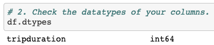
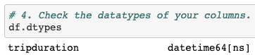
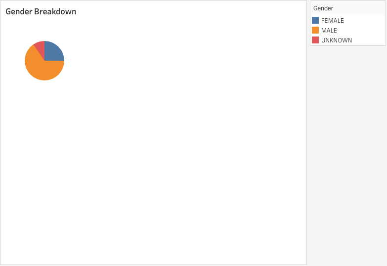
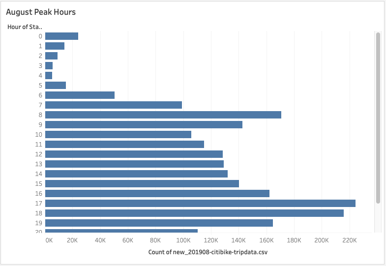
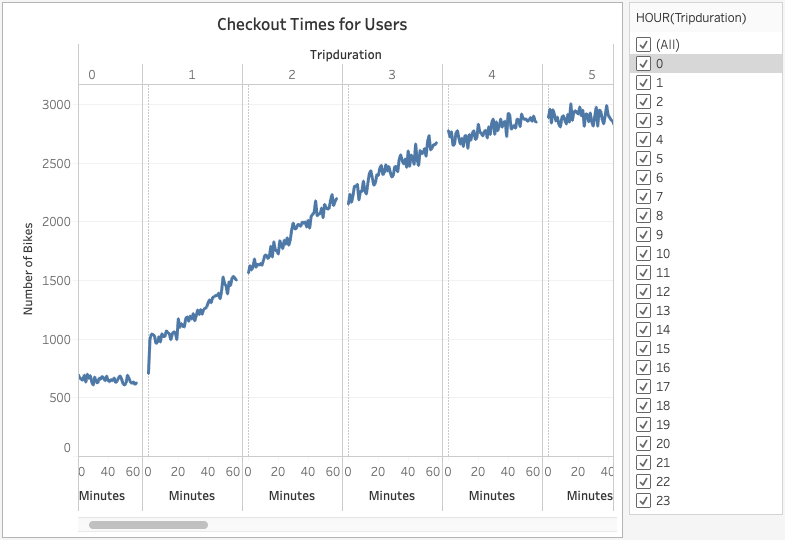
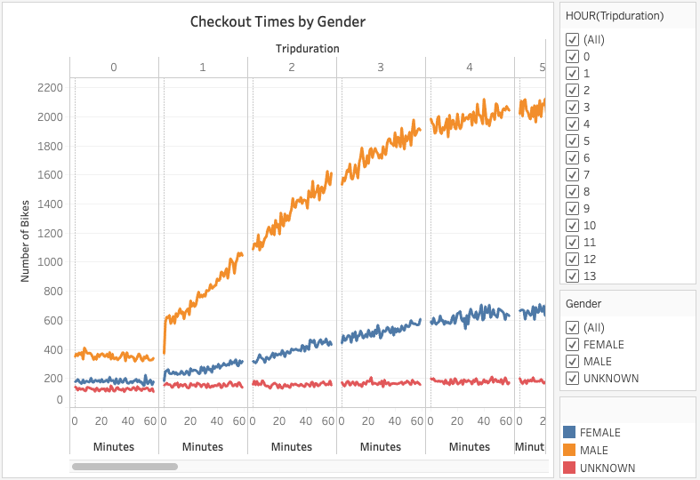
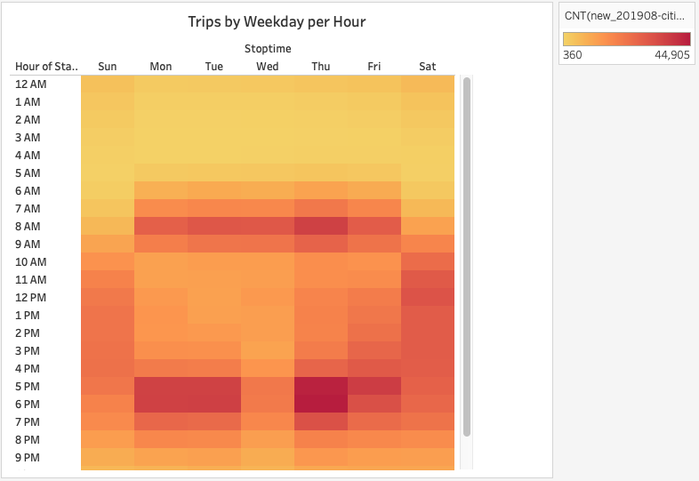

# Bikesharing

### Overview of the statistical analysis:

In this module challenge additional bike trip analysis through data visualizations were generated to convince investors that a bike-sharing program in Des Moines is a solid business proposal. 

Data visualizations for the Trip Analysis generated are as follows:

- The length of time that bikes are checked out for all riders and genders.

- The number of bike trips for all riders and genders for each hour of each day of the week.

- The number of bike trips for each type of user and gender for each day of the week.

The deliverables for this Challenge are as follows:

- Deliverable 1: Change Trip Duration to a Datetime Format

- Deliverable 2: Create Visualizations for the Trip Analysis

- Deliverable 3: Create a Story and Report for the Final Presentation

### Results:

**Deliverable 1:** Change Trip Duration to a Datetime Format

- Pandas was used to change the datatype of the "tripduration" column from an integer to a datetime datatype to get the time in hours and minutes.

**NOTE:** *The csv file was not included in this repository as it cannot be uploaded due to its file size.*

Before: unconverted csv file.

After: converted csv file.

**Deliverable 2:** Create Visualizations for the Trip Analysis

The visualizations shown below are presented on a Tableau Story format. Click the link below to visit the website:

[Link to Tableau Story with Dashboard](https://public.tableau.com/views/NYCCitibikeAnalysisStory/NYCCitibikeAnalysisStory?:language=en&:display_count=y&:origin=viz_share_link)

1. Gender Breakdown: Based on the data report, the total number of trips in August is 2,344,224. In  this visualization, the data was analyzed to show the gender breakdown of Citi Bike riders to help our investors understand a little more about the customers in NYC and can be applied in Des Moines. The data shows that majority are male riders (1,530,272) followed by females (588,431).

2. August Peak Hours: This visualization shows the peak hours for bike trips during the month of August. This will help our investors get a ballpark estimate of how many bikes we might need in Des Moines. The data can help determine which parts of the day most of the bikes are needed and can also be useful for determining when to do maintenance on a bike knowing the peak usage hours.

3. Checkout Times per Users: This visualization shows the length of time that bikes are checked out for all riders.

4. Checkout Times by Gender: In this visualization,  the data shows the length of time that bikes are checked out for each gender. The highest number of bike used is >2,000 at a tripduration of 5hrs by male riders. The shorter (<1hr) and longer (23hrs) the tripduration, the less number of bikes are used regardless of gender.

5. Trips by Weekday per Hour: In this visualization,  the number of bike trips by weekday for each hour of the day is shown in a form of a heatmap. The data shows the peak hours of when bikes are mostly used on weekdays are around 7-9AM and 4-7PM which makes sense because these are the hours where people are reporting (AM) and leaving work (PM). And bikes are mostly used throughout the day on weekends.

6. Trips by Gender (Weekday per Hour): In this visualization, the number of bike trips by gender for each hour of each day of the week is shown in a form of a heatmap. Again, the peak hours are the same from the previous slide (Trips by Weekday per Hour) and most of the users are male riders followed by female riders.

7. Number of Trips: In this visualization, the number of bike trips by gender for each hour for each day of the week is shown as a heatmap. Most of the users are subscribers and male riders.

### Summary:

The bike-sharing program in Des Moines is a solid business proposal especially that we now have the analysis that could help us better design and strategize on how to implement the program in Des Moines. The results shows that most customers are male riders followed by females and some that are not registered (unknown). The bikes are fully utilized before and after work during weekdays and all throughout the day on weekends. 

I would like to see two additional visualizations that will show the following:

1. Identify the most popular bike stations and show how many bikes are used and returned. To give us an idea if we need to supply more inventories in those areas.

2. Show stations that have the highest to lowest bike repairs and utilizations. This will help us move bikes around to temporarily replace damage bikes and help reduce costs. 
