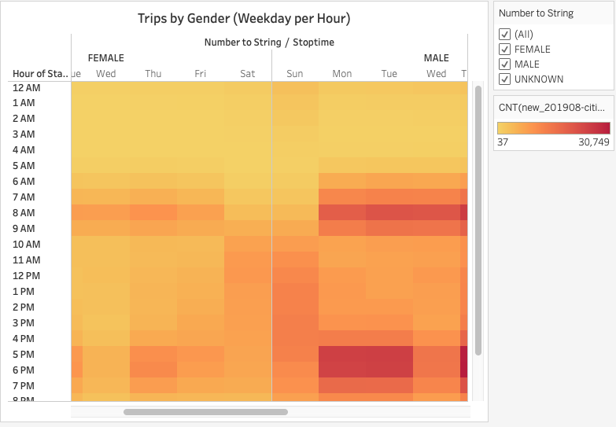
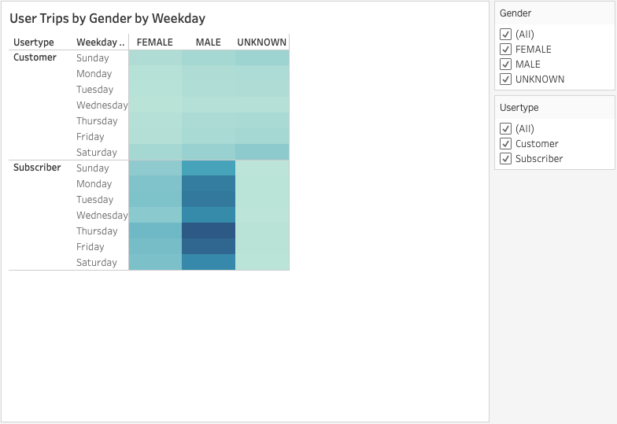

# Bikesharing

### Overview of the statistical analysis:

In this module challenge additional bike trip analysis through data visualizations were generated to convince investors that a bike-sharing program in Des Moines is a solid business proposal. 

Data visualizations for the Trip Analysis generated are as follows:

- The length of time that bikes are checked out for all riders and genders.

- The number of bike trips for all riders and genders for each hour of each day of the week.

- The number of bike trips for each type of user and gender for each day of the week.

The deliverables for this Challenge are as follows:

- Deliverable 1: Change Trip Duration to a Datetime Format

- Deliverable 2: Create Visualizations for the Trip Analysis

- Deliverable 3: Create a Story and Report for the Final Presentation

### Results:

**Deliverable 1:** Change Trip Duration to a Datetime Format

- Pandas was used to change the datatype of the "tripduration" column from an integer to a datetime datatype to get the time in hours and minutes.

**NOTE:** The csv file was not included in this repository as it cannot be uploaded due to its file size.

Before: unconverted csv file.

After: converted csv file.

**Deliverable 2:** Create Visualizations for the Trip Analysis

1. Gender Breakdown: Based on the data report, the total number of trips in August is 2,344,224. In  this visualization, the data was analyzed to show the gender breakdown of Citi Bike riders to help our investors understand a little more about the customers in NYC and can be applied in Des Moines. The data shows that majority are male riders (1,530,272) followed by females (588,431).

2. August Peak Hours: This visualization shows the peak hours for bike trips during the month of August. This will help our investors get a ballpark estimate of how many bikes we might need in Des Moines. The data can help determine which parts of the day most of the bikes are needed and can also be useful for determining when to do maintenance on a bike knowing the peak usage hours.

3. Checkout Times per Users: This visualization shows the length of time that bikes are checked out for all riders.

There are at least seven visualizations for the NYC Citibike analysis (7 pt)
There is a description of the results for each visualization (7 pt)

[Link to Tableau Story with Dashboard](https://public.tableau.com/views/NYCCitibikeAnalysisStory/NYCCitibikeAnalysisStory?:language=en&:display_count=y&:origin=viz_share_link)

### Summary:

There is a high-level summary of the results and two additional visualizations are suggested for future analysis (5 pt)
